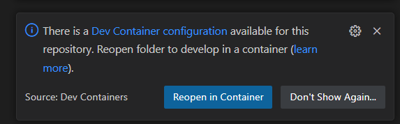
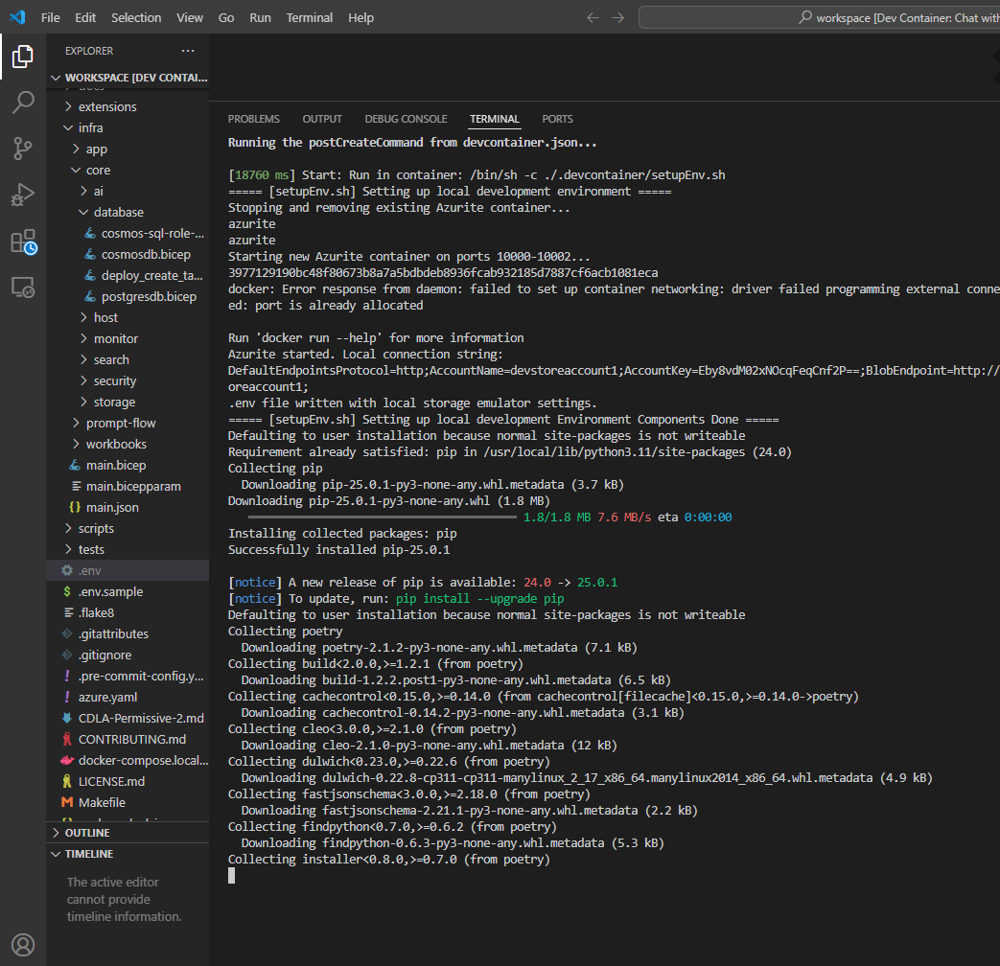
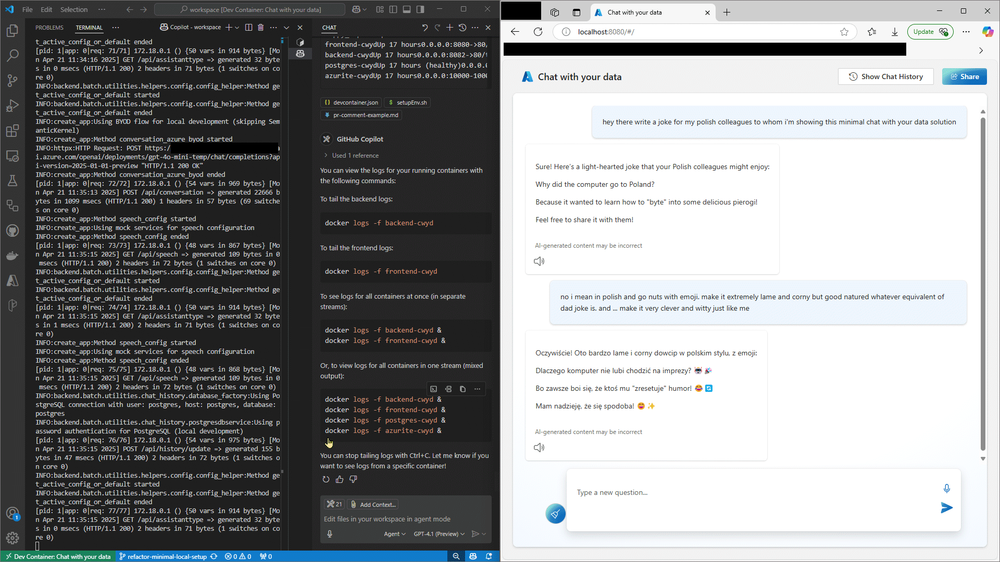

[Back to *Chat with your data* README](../README.md)

# Local Development (Fast Start)

> **This fork is optimized for rapid, modular local development.**
> No Azure subscription required for local dev. All services run locally via Docker Compose.
> Ideal for frontend/backend contributors and fast prototyping.

---

## Service Overview

| Service   | Port(s) | Description                        |
|-----------|---------|------------------------------------|
| frontend  | 8080    | React UI (Vite, hot reload)        |
| backend   | 8082    | Python API (Flask/Azure Functions) |
| admin     | 8081    | Admin UI (Streamlit)               |
| postgres  | 5432    | PostgreSQL (with pgvector)         |
| azurite   | 10000+  | Azure Blob/Queue/Table emulator    |
| migrate   | -       | DB migration/init (runs once)      |

---

## 1️⃣ Clone the Repo *Inside WSL*

**Why?**
Cloning inside WSL avoids slow file access between Windows and Linux filesystems.

```bash
git clone https://github.com/YRSzMm32YCEdUwgUOBks/chat-with-your-data-solution-accelerator.git
cd chat-with-your-data-solution-accelerator
cp .env.example .env
```

---

## 2️⃣ Open in VS Code (Dev Container)

- From your WSL terminal, run:
  ```bash
  code .
  ```
- VS Code will prompt: **"Reopen in Container"**.
  If you miss it, open the Command Palette and search for "Reopen in Container".

  

- **First build:** ~10 minutes (downloads images, builds containers).
  **Subsequent builds:** ~2 minutes.



---

## 3️⃣ Start All Services

This should be done automatically when the devcontainer reopens. If not, or to reinitalize, run from the VS Code terminal (or WSL shell):

```bash
./start.sh
```

- This loads your `.env` and starts all services via Docker Compose.
- **To tail all logs in real time (recommended):**
  ```bash
  docker compose -f docker-compose.local.yml logs -f
  ```
  > (Use `docker compose` not `docker-compose` for best compatibility.)


---

## 4️⃣ Access the Apps

- **Frontend:** [http://localhost:8080/](http://localhost:8080/)
- **Admin:** [http://localhost:8081/](http://localhost:8081/)
- **Backend API:** [http://localhost:8082/](http://localhost:8082/)

> ![place screenshot of all three apps running in browser here]

---

## 5️⃣ Typical Workflow

- Edit code in `code/frontend`, `code/backend`, or `code/backend/batch`.
- Frontend hot reloads automatically.
- Backend/admin restart on code changes (or restart containers).
- Database and storage persist unless you remove Docker volumes.

---

## Advanced: Run Individual Services

**Frontend only:**
```bash
cd code/frontend
npm install
npm run dev
# → http://localhost:5174/
```

**Backend only:**
```bash
cd code/backend
poetry install
poetry run flask run
# → http://localhost:5000/
```

---

## Troubleshooting

- **Docker not running?** Start Docker Desktop in Windows before launching WSL/VS Code.
- **Dev Container build slow?** Make sure you are in WSL, not Windows filesystem.
- **.env issues?** Copy `.env.example` and fill in as needed.

---

## Reference

- [This fork](https://github.com/YRSzMm32YCEdUwgUOBks/chat-with-your-data-solution-accelerator)
- [Upstream Microsoft repo](https://github.com/Azure-Samples/chat-with-your-data-solution-accelerator)

---

## Legacy/Advanced (Azure, RBAC, Bicep, etc.)

- For full Azure deployment, RBAC, or advanced configuration, see the [original Microsoft README](https://github.com/Azure-Samples/chat-with-your-data-solution-accelerator/blob/main/README.md).
- **macOS Apple Silicon:** DevContainer may not work ([see upstream issue](https://github.com/Azure/azure-functions-core-tools/issues/3112)). Use [NON_DEVCONTAINER_SETUP.md](../NON_DEVCONTAINER_SETUP.md) if needed.

## Environment variables

> **Note:** Many of the environment variables listed below are for Azure cloud deployment and are not required for local development. This section will be cleaned up in the future to better distinguish between local and cloud-only variables.

### Minimum required environment variables for local deployment

For a typical local setup, you only need to set the following variables in your `.env` file:

- `POSTGRES_PASSWORD` – Password for the local PostgreSQL instance
- `AZURE_OPENAI_API_KEY` – (Optional for local, only if testing OpenAI integration)
- `AZURE_OPENAI_MODEL_NAME` – (Optional, defaults to `gpt-4o`)
- `AZURE_OPENAI_EMBEDDING_MODEL_NAME` – (Optional, defaults to `text-embedding-ada-002`)

All other variables can be left as defaults or empty for local-only development.


| App Setting | Value | Note |
| --- | --- | ------------- |
|AZURE_SEARCH_SERVICE||The URL of your Azure AI Search resource. e.g. https://<search-service>.search.windows.net|
|AZURE_SEARCH_INDEX||The name of your Azure AI Search Index|
|AZURE_SEARCH_KEY||An **admin key** for your Azure AI Search resource|
|AZURE_SEARCH_USE_SEMANTIC_SEARCH|False|Whether or not to use semantic search|
|AZURE_SEARCH_SEMANTIC_SEARCH_CONFIG|default|The name of the semantic search configuration to use if using semantic search.|
|AZURE_SEARCH_TOP_K|5|The number of documents to retrieve from Azure AI Search.|
|AZURE_SEARCH_ENABLE_IN_DOMAIN|True|Limits responses to only queries relating to your data.|
|AZURE_SEARCH_CONTENT_COLUMN||List of fields in your Azure AI Search index that contains the text content of your documents to use when formulating a bot response. Represent these as a string joined with "|", e.g. `"product_description|product_manual"`|
|AZURE_SEARCH_CONTENT_VECTOR_COLUMN||Field from your Azure AI Search index for storing the content's Vector embeddings|
|AZURE_SEARCH_DIMENSIONS|1536| Azure OpenAI Embeddings dimensions. 1536 for `text-embedding-ada-002`. A full list of dimensions can be found [here](https://learn.microsoft.com/en-us/azure/ai-services/openai/concepts/models#embeddings-models). |
|AZURE_SEARCH_FIELDS_ID|id|`AZURE_SEARCH_FIELDS_ID`: Field from your Azure AI Search index that gives a unique idenitfier of the document chunk. `id` if you don't have a specific requirement.|
|AZURE_SEARCH_FILENAME_COLUMN||`AZURE_SEARCH_FILENAME_COLUMN`: Field from your Azure AI Search index that gives a unique idenitfier of the source of your data to display in the UI.|
|AZURE_SEARCH_TITLE_COLUMN||Field from your Azure AI Search index that gives a relevant title or header for your data content to display in the UI.|
|AZURE_SEARCH_URL_COLUMN||Field from your Azure AI Search index that contains a URL for the document, e.g. an Azure Blob Storage URI. This value is not currently used.|
|AZURE_SEARCH_FIELDS_TAG|tag|Field from your Azure AI Search index that contains tags for the document. `tag` if you don't have a specific requirement.|
|AZURE_SEARCH_FIELDS_METADATA|metadata|Field from your Azure AI Search index that contains metadata for the document. `metadata` if you don't have a specific requirement.|
|AZURE_SEARCH_FILTER||Filter to apply to search queries.|
|AZURE_SEARCH_USE_INTEGRATED_VECTORIZATION ||Whether to use [Integrated Vectorization](https://learn.microsoft.com/en-us/azure/search/vector-search-integrated-vectorization)|
|AZURE_OPENAI_RESOURCE||the name of your Azure OpenAI resource|
|AZURE_OPENAI_MODEL||The name of your model deployment|
|AZURE_OPENAI_MODEL_NAME|gpt-4o|The name of the model|
|AZURE_OPENAI_MODEL_VERSION|2024-05-13|The version of the model to use|
|AZURE_OPENAI_API_KEY||One of the API keys of your Azure OpenAI resource|
|AZURE_OPENAI_EMBEDDING_MODEL|text-embedding-ada-002|The name of your Azure OpenAI embeddings model deployment|
|AZURE_OPENAI_EMBEDDING_MODEL_NAME|text-embedding-ada-002|The name of the embeddings model (can be found in Azure AI Foundry)|
|AZURE_OPENAI_EMBEDDING_MODEL_VERSION|2|The version of the embeddings model to use (can be found in Azure AI Foundry)|
|AZURE_OPENAI_TEMPERATURE|0|What sampling temperature to use, between 0 and 2. Higher values like 0.8 will make the output more random, while lower values like 0.2 will make it more focused and deterministic. A value of 0 is recommended when using your data.|
|AZURE_OPENAI_TOP_P|1.0|An alternative to sampling with temperature, called nucleus sampling, where the model considers the results of the tokens with top_p probability mass. We recommend setting this to 1.0 when using your data.|
|AZURE_OPENAI_MAX_TOKENS|1000|The maximum number of tokens allowed for the generated answer.|
|AZURE_OPENAI_STOP_SEQUENCE||Up to 4 sequences where the API will stop generating further tokens. Represent these as a string joined with "|", e.g. `"stop1|stop2|stop3"`|
|AZURE_OPENAI_SYSTEM_MESSAGE|You are an AI assistant that helps people find information.|A brief description of the role and tone the model should use|
|AZURE_OPENAI_API_VERSION|2024-02-01|API version when using Azure OpenAI on your data|
|AzureWebJobsStorage||The connection string to the Azure Blob Storage for the Azure Functions Batch processing|
|BACKEND_URL||The URL for the Backend Batch Azure Function. Use http://localhost:7071 for local execution|
|DOCUMENT_PROCESSING_QUEUE_NAME|doc-processing|The name of the Azure Queue to handle the Batch processing|
|AZURE_BLOB_ACCOUNT_NAME||The name of the Azure Blob Storage for storing the original documents to be processed|
|AZURE_BLOB_ACCOUNT_KEY||The key of the Azure Blob Storage for storing the original documents to be processed|
|AZURE_BLOB_CONTAINER_NAME||The name of the Container in the Azure Blob Storage for storing the original documents to be processed|
|AZURE_FORM_RECOGNIZER_ENDPOINT||The name of the Azure Form Recognizer for extracting the text from the documents|
|AZURE_FORM_RECOGNIZER_KEY||The key of the Azure Form Recognizer for extracting the text from the documents|
|APPLICATIONINSIGHTS_CONNECTION_STRING||The Application Insights connection string to store the application logs|
|ORCHESTRATION_STRATEGY | openai_function | Orchestration strategy. Use Azure OpenAI Functions (openai_function), Semantic Kernel (semantic_kernel),  LangChain (langchain) or Prompt Flow (prompt_flow) for messages orchestration. If you are using a new model version 0613 select any strategy, if you are using a 0314 model version select "langchain". Note that both `openai_function` and `semantic_kernel` use OpenAI function calling. Prompt Flow option is still in development and does not support RBAC or integrated vectorization as of yet.|
|AZURE_CONTENT_SAFETY_ENDPOINT | | The endpoint of the Azure AI Content Safety service |
|AZURE_CONTENT_SAFETY_KEY | | The key of the Azure AI Content Safety service|
|AZURE_SPEECH_SERVICE_KEY | | The key of the Azure Speech service|
|AZURE_SPEECH_SERVICE_REGION | | The region (location) of the Azure Speech service|
|AZURE_AUTH_TYPE | keys | The default is to use API keys. Change the value to 'rbac' to authenticate using Role Based Access Control. For more information refer to section [Authenticate using RBAC](#authenticate-using-rbac)

## Bicep

A [Bicep file](./infra/main.bicep) is used to generate the [ARM template](./infra/main.json). You can deploy this accelerator by the following command if you do not want to use `azd`.

```sh
az deployment sub create --template-file ./infra/main.bicep --subscription {your_azure_subscription_id} --location {search_location}
 ```
